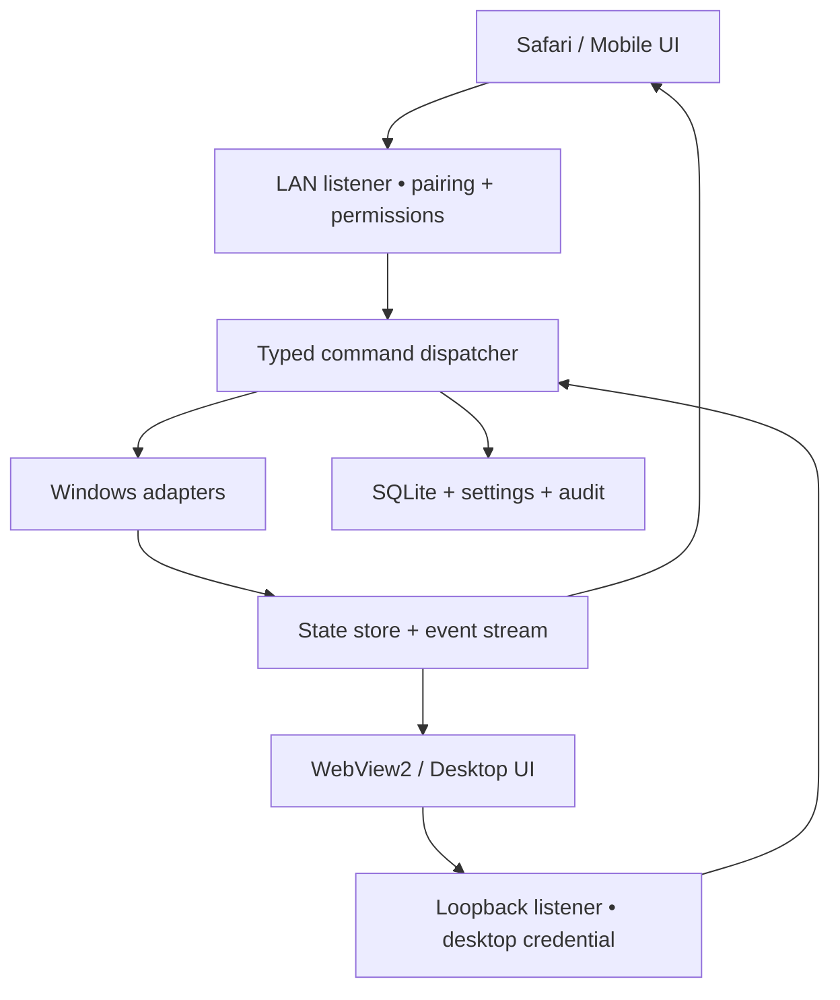

# LocalControl — архитектура и продукт, 6 октября 2026

Это целевая архитектура полной версии. В 0.2.0-dev реализован ограниченный срез tray/server/pairing/audio/status/app launch; текущие отличия и непроверенные этапы перечислены в README. В частности, device store пока bounded atomic JSON, audio adapter использует NAudio.Wasapi 2.2.1; SQLite, HTTPS, updater и остальные подсистемы ещё впереди.

## Решение

Windows 11 x64, C#/.NET 10 LTS, self-contained publish. WinForms — маленькая native оболочка с NotifyIcon и WebView2, а не отдельный второй UI. ASP.NET Core/Kestrel работает в **том же пользовательском процессе Desktop**, использует Windows-адаптеры и обслуживает React/TypeScript/Vite bundle. Закрытие окна прячет его в tray; Exit отменяет фоновые задачи, отключает клиентов и корректно останавливает Kestrel. Сервер выключается/включается без завершения tray. Отдельный executable нужен только updater.

Такой host устраняет orphan server process, не требует службы Windows и работает в интерактивной пользовательской сессии, где доступны микрофон, media sessions и clipboard. Общие проекты имеют реальные границы, а не десятки микросервисов. Администраторские права не нужны для обычного аудио/discovery. Узкий helper с явным UAC используется только для согласованных изменений брандмауэра/машинного startup.

React выбран для production UI; текущий HTML-прототип независим от backend и задаёт tokens, компоненты и состояния. Компоненты/логика затем переносятся в React без переноса demo-adapter. WebView2 не получает произвольный shell bridge. Все внешние ссылки открываются системным браузером.

## Связи

LAN listener — выбранные интерфейсы, порт по умолчанию 41017 (проверяется при первом запуске); loopback admin listener — отдельный динамический порт. Нельзя вывести административные маршруты в LAN через проверку `localhost` или spoofable header. Host знает listener, на котором принят запрос. Desktop cookie/bootstrap выдаётся только native host через WebView2 CookieManager; обычный localhost browser не получает desktop privileges автоматически.

## 1.0 / позже

| Область | 1.0 | Later |
|---|---|---|
| Desktop | Tray, WebView2, first run, RU/EN, Dark/Light/System | Rich taskbar integrations |
| Mobile | Safari LAN, свой bottom nav, safe areas | HTTPS offline/PWA расширения |
| Audio | Master, input endpoint, session volume/mute, real events, device list | Routing audio между устройствами |
| Discord | Discovery/launch, output sessions, системный mic, локально заданный keybind | Официальный авторизованный RPC при подтверждённой доступности |
| Apps | Start Menu, App Paths, uninstall metadata, Store launch, custom exe, favorites, close/restart | Более сложные launcher plugins |
| Steam | `libraryfolders.vdf`, `appmanifest_*.acf`, local artwork, `steam://run/{appid}` | Остальные launchers |
| Startup | HKCU Run и user Startup enable/disable с восстановлением; HKLM/tasks read-only | Администрируемые task/machine изменения |
| Power | Lock, sleep, restart, shutdown; hibernate только если доступен | Wake-on-LAN с другого включённого устройства |
| Hardware | CPU/RAM/disks/network/OS/GPU metadata, графики, capabilities | Температуры/fans через opt-in sensor provider |
| Remote | Выбор монитора, snapshot, refresh, click/scroll/basic keyboard, отдельное разрешение | DXGI capture → H.264 → WebRTC video + data channel |
| Transfers | Send to PC, temporary download queue, progress/cancel/retry, quotas | Resumable large uploads |
| Clipboard | Только явное чтение/запись text/URL, permission | Images/history |
| Media | Windows media sessions, title/artwork/play/pause/prev/next | App-specific enhancements |
| Security | Desktop approval, per-device permissions, revoke, expiry/rate limits/origin checks | Дополнительная hardening/security review |
| Setup/update | Per-user NSIS RU/EN, prerequisite detection, backup/rollback | Автоматические подписанные обновления без ручного выбора пакета |

Это **план версии 1.0**, а не перечень уже реализованных функций. Capability-driven UI скрывает недоступные операции и объясняет причину. Температура без sensor provider — «Недоступно», не выдуманные 0°C.

## Конкретные Windows API

| Функция | API/подход | Ограничение |
|---|---|---|
| Audio devices | `IMMDeviceEnumerator`, `IMMDevice`, `IMMNotificationClient` | Stable endpoint IDs, invalidate unplugged COM references |
| Per-app audio | `IAudioSessionManager2`, `IAudioSessionEnumerator`, `IAudioSessionControl2.GetProcessId`, `ISimpleAudioVolume` | Shared-mode sessions; несколько sessions одного app управляются группой |
| Master / mic | `IAudioEndpointVolume.Get/SetMute`, `Get/SetMasterVolumeLevelScalar`, callback | Mic mute влияет на выбранное input устройство, не на кнопку Discord |
| Audio events | `IAudioSessionNotification`, `IAudioSessionEvents`, `IAudioEndpointVolumeCallback` | Worker COM apartment, dispose/unregister, UI dispatch не на callback thread |
| Default device | Список через MMDevice; открыть Windows Sound Settings | Общедоступного документированного setter в MMDevice API нет; undocumented PolicyConfig не core 1.0 |
| Start Menu apps | Known folders, `.lnk` через `IShellLinkW`/`IPersistFile`, Shell icons | Shortcut не обязан вести прямо на exe |
| Installed apps | HKCU/HKLM Uninstall (32/64-bit views), `App Paths` | UninstallString нельзя выполнять как Launch |
| Store apps | Shell `shell:AppsFolder` + AUMID; `IApplicationActivationManager.ActivateApplication` | AUMID — отдельный тип цели, не путь к exe |
| Processes | `Process`, `CloseMainWindow`, trusted `ProcessStartInfo.ArgumentList` | Безопасная привязка PID + start time + executable; не принимать PID из телефона |
| Startup | HKCU/HKLM Run, user/common Startup, Task Scheduler COM read | Нет общей документированной write API для Task Manager StartupApproved; бинарный формат не правим |
| Hardware | `GetSystemTimes`, `GlobalMemoryStatusEx`, cached WMI/CIM (`Win32_Processor`, `VideoController`, `BaseBoard`, `OperatingSystem`), `DriveInfo`, NetworkInterface | GPU metadata есть; точный GPU load — capability отдельного provider, не метрика WMI |
| GPU load | PDH GPU Engine counters, агрегация по adapter/engine | Не суммировать в >100%; read unavailable при несовместимом драйвере |
| Displays | `EnumDisplayMonitors`, `GetMonitorInfo`, `QueryDisplayConfig` | Сохранять monitor identity, а не только индекс |
| Power | `LockWorkStation`, `SetSuspendState`, `ExitWindowsEx`, `PowerGetActiveScheme` | Проверить privileges и support; shutdown confirmation обязателен |
| Media | `GlobalSystemMediaTransportControlsSessionManager.RequestAsync`, session Try* methods + events | Работает только с приложениями, публикующими Windows media sessions |
| Clipboard | WinForms Clipboard на dedicated STA thread | Читать только после explicit action; buffer не входит в логи |
| Remote snapshot | GDI `BitBlt`/CopyFromScreen, JPEG encode | Не stream; ограничить размер и rate, protected content/lock screen могут быть недоступны |
| Remote input | `SendInput` normalized coordinates + typed keys | UIPI: не управляет elevated окнами или UAC secure desktop; без обхода |
| Remote stream | `IDXGIOutputDuplication`/Windows Graphics Capture + Media Foundation + WebRTC library evaluation | Не заявлять low latency до замеров; браузер iPhone проверять на целевом устройстве |
| Sensors Later | LibreHardwareMonitor, MPL-2.0 | Opt-in, review driver/elevation и license notices до включения |

Native interop изолирован в Windows проекте; CsWin32 возможен для генерации P/Invoke после проверки пакета/license. Для Core Audio — маленький COM adapter, без лишнего audio playback framework. Реестр, Shell и Steam discovery используют bounded scan, cancellation и cache.

## Discord и audio

Discord создаёт audio sessions в Windows. Получаем процесс каждого session, сопоставляем verified executable с discovered app. Один UI row может управлять несколькими Discord render sessions. Volume/mute → `ISimpleAudioVolume`; callback → state store → SignalR → все открытые UI. Новые sessions наследуют целевую громкость только после проверки app identity.

Микрофон — отдельный input endpoint. UI пишет «Микрофон Windows выключен» и название устройства. Discord может продолжать показывать свой mic как включённый; это не ошибка LocalControl и не основание рисовать fake Discord state.

Официальная Discord RPC документация действительно описывает `GET_VOICE_SETTINGS`, `SET_VOICE_SETTINGS` и события, но требует authentication/scopes и имеет ограничения доступа. Поэтому фраза «у Discord вообще нет API» неверна, а обещать его гарантированную работу для public offline utility тоже нельзя. В 1.0 пользователь **на ПК** задаёт Discord global keybind; LocalControl отправляет только эту разрешённую комбинацию через SendInput. UI показывает «Комбинация отправлена; состояние Discord неизвестно». Не сохраняем Discord user token, не делаем self-bot, memory reading или injection. Точный Mute/Deafen Later — только при реально доступном официальном интеграционном механизме.

## Производительность и realtime

Единый state store с монотонной `revision`. Первое подключение получает snapshot, затем deltas по SignalR. Reconnect запрашивает missed revisions или новый snapshot. Audio/process события обновляют store; нагрузки CPU/RAM/network: 1 s только при открытом dashboard, 5–10 s в фоне, hardware metadata кешируется. Peak meters 10 Hz только на открытом Audio screen, сетевые updates coalesce. Discovery — first run/Rescan + debounced изменения shortcuts/manifests, не обход всех дисков. WMI не используется в каждом render tick.

Commands валидируются и помещаются в bounded serial executor для конкретного adapter. Slider coalesces до 20 updates/s с final commit; UI отображает pending/confirmed/error, server state авторитетен. No optimistic fake success после ошибки Windows.

## Установка и обновление

Install: `%LOCALAPPDATA%\Programs\LocalControl`; data: `%LOCALAPPDATA%\LocalControl`. Portable означает переносимые binaries; user settings остаются в LocalAppData, чтобы не смешивать данные и подписанный payload. Transfer default: `Downloads\LocalControl`.

NSIS создаёт shortcuts/uninstall и проверяет WebView2 Runtime. Online setup предлагает Microsoft prerequisite installer; отдельный offline bundle возможен после проверки правил распространения Microsoft. Без WebView2 сервер может работать и открывать browser UI, но отсутствие desktop shell объясняется. Core не требует .NET runtime installation благодаря self-contained publish. Заявление «internet not required» относится к установленным core-функциям, не к скачиванию отсутствующего prerequisite.

Updater — отдельный небольшой executable: проверка **подписанного manifest** с pinned public key, hashes payload, path traversal/reparse defense → stage на том же томе → stop host через CurrentUserOnly named pipe → backup immutable binaries + согласованный backup БД/миграций → replace → запуск/health check → commit. При ошибке восстанавливаются binaries и совместимая DB snapshot. Settings/paired devices/custom apps сохраняются. SHA-256 без подписи не аутентифицирует пакет. Authenticode желателен для публичного Setup; пока сертификата нет, подпись продукта не выдумываем. Source ZIP excludes user data, secrets, bin/obj/node_modules, includes lockfiles/licenses.
